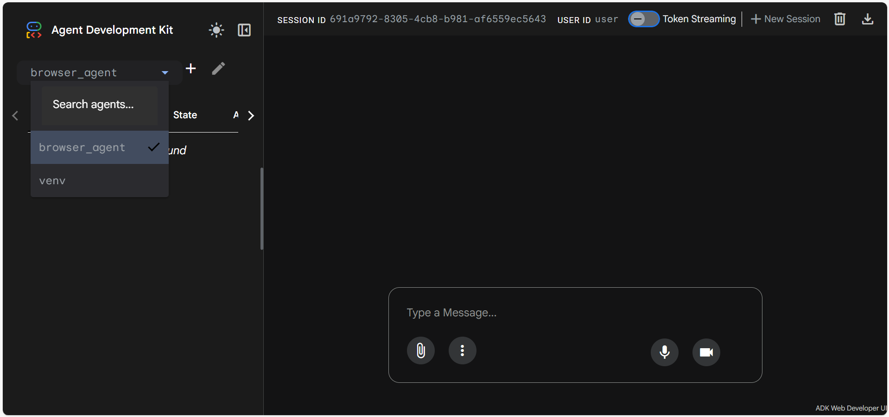
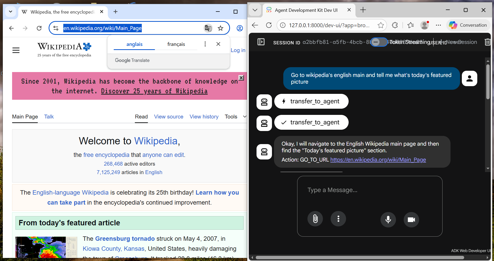
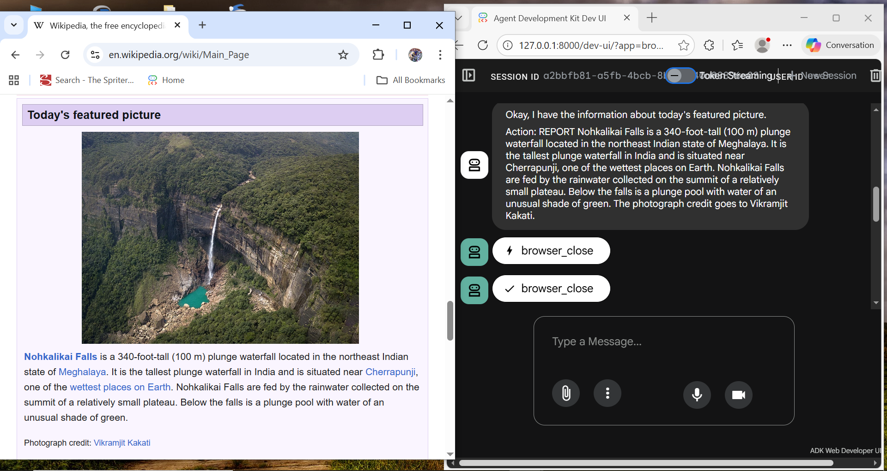

# Google-ADK-browser-automation

This is a simple example for automatic browsing with visual streaming using **Google's Agent Development Kit**.  
## Overview  
The code uses a simple orchestration -Defined in [agent.py](browser_agent/agent.py)- of a `root_agent` -Any ADK app requires an agent named as that- which calls a `LoopAgent`. This latter hosts the communication between two subagents: `navigation_agent` the navigation planner and `browser_agent`which opens an actual browser using `playwright` from ADK's built-in `mcp_toolset`.  
## Initialization
For Python version, this code works on **3.11+**.  
In order to run the code properly, add a `.env` file containg whether your `GEMINI_API_KEY` or:  
```
GOOGLE_CLOUD_PROJECT=YOUR_GCP_ID
GOOGLE_CLOUD_LOCATION=global # recommended but you can use any region e.g. uscentral1
GOOGLE_APPLICATION_CREDENTIALS=YOUR_CREDENTIALS_JSON_FILEPATH
GOOGLE_GENAI_USE_VERTEXAI=TRUE
```
For this example you need only the package `google-adk`  
``` 
pip install google-adk
```
or 
```
pip install -r requirements.txt
```
Then you can run the agents in ADK's built-in UI using the command -outside the agent folder-
```
adk web
```
And congratulations, now choose the agent folder and write your prompt.  


The agent closed the browser immediately so I browsed myself just to check if the result is true:

<details>
  <summary>What's supposed to happen?</summary>
  Once you write your prompt, the assistant agent creats a first step and transfers to the browser agent.  
  Then a Chrome window appears streaming the agent browsing while looking to answer your prompt.  
</details>

## Notes
- I had an issue where ADK couldn't read IPV6 adresses, so these lines are just for safety, it may work fine without them for you:
```
import os
os.environ["HTTPX_FORCE_IPV4"] = "1"
```
- These prompts are just a quick test. In order to avoid token exhaustion, feel free to add more instructions on dealing with pop-up elements or login-demanding sites. Just always make sure the agents declaration is within a python file named **`agent.py`** 
